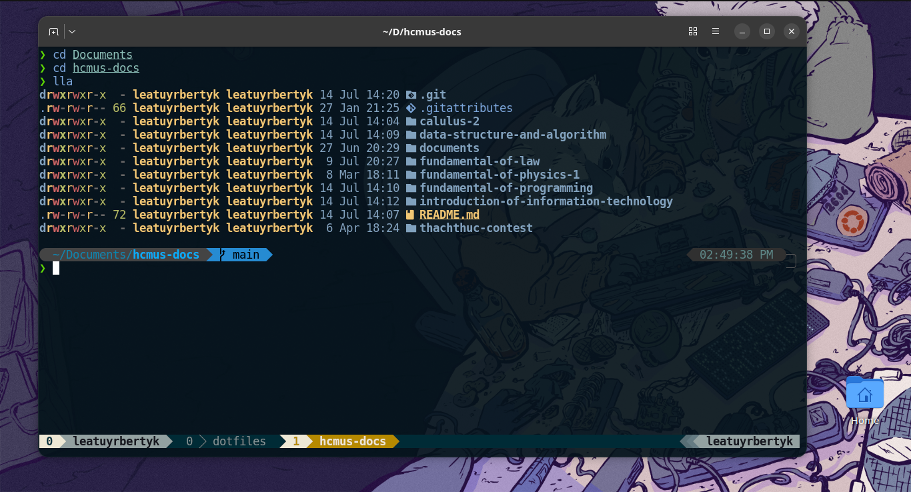
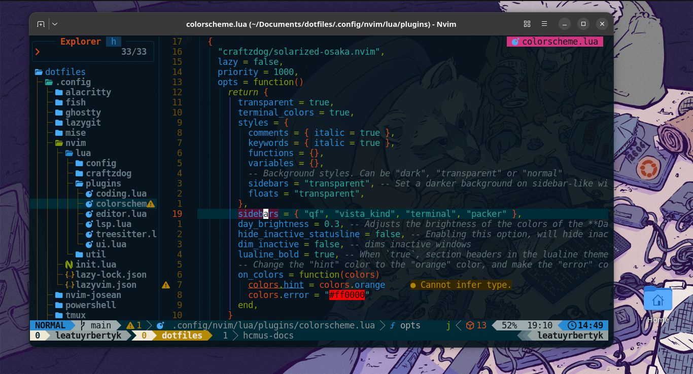

# Leatuyr Bertyk's dotfiles

My workspace is based on [craftzdog/dotfiles-public](https://github.com/craftzdog/dotfiles-public) by Takuya Matsuyama (a freelancer from Japan who created [Inkdrop](https://www.inkdrop.app/)) and [josean-dev/dev-environment-files](https://github.com/josean-dev/dev-environment-files) by Josean Martinez (a full-stack software engineer). I have made personal changes so the original configurations are suitable for my coding workspace on Ubuntu (26.04 LTS) and Windows 10.

## Main workspace

I primarily use Ubuntu as my default environment because of its versatility. Main tools include:

- **Kitty** and **Ghostty** - Default terminal emulators; I usually use Kitty.
- **tmux** - Terminal multiplexer.
- **yazi** - Terminal file manager.
- **Fish** - Default shell; convenient, but uses a unique configuration style.
- **Neovim** - Default text editor; built around Lazy.nvim.
- **Visual Studio Code** - Another code editor suitable for collaboration or large projects.
- **Zed** - New AI code editor, suitable for **Quarto**.
- **Git** - Project version control system.
- **lazygit** - GUI Git manager.

**_Optional:_**

- **zsh** - Alternative shell with basic configuration.
- **Alacritty** and **Wezterm** - Other terminals with different advantages depending on your needs.
- **Vim** - Legendary code editor; fast, but older and harder to configure.

## Requirements

### Shell setup (macOS & Linux)

- Neovim >=**0.9.0** (built with **LuaJIT**)
- [LazyVim](https://www.lazyvim.org/)
- Git >=**2.19.0**
- [lazygit](https://github.com/jesseduffield/lazygit)
- [Node.js](https://nodejs.org/en)
- [yazi](https://github.com/sxyazi/yazi)
- [Visual Studio Code](https://code.visualstudio.com/) **_(optional)_**
- [Zed](https://zed.dev/) **_(optional)_**
- [Vim](https://www.vim.org/) **_(optional)_**
- a **C** compiler for `nvim-treesitter`. See [here](https://github.com/nvim-treesitter/nvim-treesitter#requirements)
- for [telescope.nvim](https://github.com/nvim-telescope/telescope.nvim) **_(optional)_**
  - **live grep**: [ripgrep](https://github.com/BurntSushi/ripgrep)
  - **find files**: [fd](https://github.com/sharkdp/fd)
- a terminal that supports true color and _undercurl_:
  - [Ghostty](https://github.com/ghostty-org/ghostty) **_(Linux & macOS)_** (recommended for macOS)
  - [Kitty](https://github.com/kovidgoyal/kitty) **_(Linux & macOS)_** (recommended for Linux)
  - [Wezterm](https://github.com/wez/wezterm) **_(Linux, macOS & Windows)_**
  - [Alacritty](https://github.com/alacritty/alacritty) **_(Linux, macOS & Windows)_**
  - [iterm2](https://iterm2.com/) **_(macOS)_**
- [tmux](https://github.com/tmux/tmux/wiki)
- [Solarized Osaka](https://github.com/craftzdog/solarized-osaka.nvim)
- [Fish shell](https://fishshell.com/)
- [Fisher](https://github.com/jorgebucaran/fisher) - Plugin manager
- [Tide](https://github.com/IlanCosman/tide) - Shell theme
- [Nerd fonts](https://github.com/ryanoasis/nerd-fonts) - Patched fonts for development use; I use [PlemolJP](https://github.com/yuru7/PlemolJP) and [BlexMono](https://www.nerdfonts.com/font-downloads)
- [z for fish](https://github.com/jethrokuan/z) - Directory jumping
- [Eza](https://github.com/eza-community/eza) - `ls` replacement
- [ghq](https://github.com/x-motemen/ghq) - Local Git repository organizer
- [fzf](https://github.com/PatrickF1/fzf.fish) - Interactive filtering
- [bat](https://github.com/sharkdp/bat) - Better `cat`
- [curl](https://curl.se/) - Command-line tool for transferring data with URLs.

### PowerShell setup (Windows)

- Neovim >=**0.9.0** (built with **LuaJIT**)
- [LazyVim](https://www.lazyvim.org/)
- Git >=**2.19.0**
- [lazygit](https://github.com/jesseduffield/lazygit)
- [Node.js](https://nodejs.org/en)
- [Visual Studio Code](https://code.visualstudio.com/) **_(optional)_**
- [Zed](https://zed.dev/) **_(optional)_**
- [Vim](https://www.vim.org/) **_(optional)_**
- [Windows Terminal](https://learn.microsoft.com/en-us/windows/terminal/install) - Default terminal manager
- [PowerShell 7](https://learn.microsoft.com/en-us/powershell/scripting/install/install-powershell-on-windows?view=powershell-7.6) - Default shell
- [MSYS2](https://www.msys2.org/) - a `C/C++` compiler for Windows
- [Nerd fonts](https://github.com/ryanoasis/nerd-fonts) - Patched fonts for development use; I use [Hack Nerd Font](https://www.nerdfonts.com/font-downloads)
- [Scoop](https://scoop.sh/) - A command-line installer
- [Git for Windows](https://gitforwindows.org/)
- [Oh My Posh](https://ohmyposh.dev/) - Prompt theme engine
- [Terminal Icons](https://github.com/devblackops/Terminal-Icons) - Folder and file icons
- [PSReadLine](https://docs.microsoft.com/en-us/powershell/module/psreadline/) - Cmdlets for customizing the editing environment, used for autocompletion
- [z](https://www.powershellgallery.com/packages/z) - Directory jumper
- [PSFzf](https://github.com/kelleyma49/PSFzf) - Fuzzy finder
- [curl](https://curl.se/) - Command-line tool for transferring data with URLs.

## macOS & Linux setup

> [!IMPORTANT]
> Available for all except `config/powershell`.

First, make sure you have downloaded all required tools, packages, and dependencies. Then, to simplify installation, use [GNU Stow](https://github.com/aspiers/stow) to automatically link configuration files from this repository to your system. Follow the steps below:

1. Clone the repository:
   ```bash
   cd ~/Documents/ &&
   git clone https://github.com/LeatuyrBertyk/dotfiles/
   ```
2. Make the script executable:
   ```bash
   cd ~/Documents/dotfiles/scripts/ &&
   chmod +x install-macos-linux.sh
   ```
3. Stow all configuration into the system:
   ```bash
   cd ~/Documents/dotfiles/scripts/ &&
   ./install-macos-linux.sh
   ```

> [!IMPORTANT]
> You can edit `scripts/install-macos-linux.sh` to suit your needs before executing it. However, you should stow one terminal from `alacritty`, `ghostty`, `kitty`, or `wezterm`, as well as `fish`, `nvim`, and `tmux`, for a complete experience.

> [!WARNING]
> **GNU Stow** is sensitive, so make sure your personal system configuration files do not already exist before performing step 3 to prevent overwriting errors. Typically, those files do not exist on a first-time installation. If they do exist, back them up before running that command.

After stowing the configuration, your **Fish** theme may appear very simple because the **Tide** plugin has not started. Follow the remaining steps below:

4. Customize **Tide** theme:
   ```bash
   tide configure
   ```

   Choose the options you want at each step, then type `y` at the end to accept the changes. My theme choices were: `2 1 3 3 1 1 4 2 1 2 3 2 1 2`, followed by `y`.

> [!TIP]
> If you want to use `config/nvim-josean` as the default **Neovim** configuration, first rename `config/nvim` to another name (for example, `config/nvim-craftzdog`), rename `config/nvim-josean` to `config/nvim`, then perform step 3. Do the same for **Tmux** by renaming `config/tmux-josean`.

> [!TIP]
> Linux and macOS are ideal environments for coding. So for `C/C++` support in **Neovim**, you only need to type `:Mason`, search `clangd` and install it.

### Optional setup for Kitty, Vim, VSCode, and Zed

These configurations are optional; use them only when the corresponding tools are stowed.

1. For **Kitty**:

   **Kitty** has many available themes. You can choose any theme you prefer with the command:
   ```bash
   kitty +kitten themes
   ```

   However, I recommend using the **Solarized Osaka** theme to sync with the other tool configurations:
   ```bash
   kitty +kitten themes Solarized\ Osaka
   ```

2. For **Vim**:

   To enable plugins in **Vim**, download `vim-plug` using the command below:
   ```bash
   curl -fLo ~/.vim/autoload/plug.vim --create-dirs \
    https://raw.githubusercontent.com/junegunn/vim-plug/master/plug.vim
   ```

   Then open **Vim** and type `:PlugInstall` to install all plugins listed in `vim/.vimrc.plug`. You may see an alert about a missing theme. Do not worry; press `Enter` to accept it, then reopen **Vim** and the theme will update.

3. For **VSCode**:

   **VSCode** will not apply new configuration if required extensions have not been installed, because the app does not have a mechanism to automatically install extensions referenced in `settings.json`. So after stowing `settings.json` for **VSCode**, run the following command:

   ```bash
   cd ~/Documents/dotfiles/scripts/ &&
   chmod +x install-vscode-extensions-macos-linux.sh &&
   ./install-vscode-extensions-macos-linux.sh
   ```

4. For **Zed**:

   You can swap the names of the two `.json` files in `dotfiles/config/zed/` so that the official configuration is in `settings.json`; do this before stowing.

## Windows setup

> [!IMPORTANT]
> Available only for `config/nvim`, `nvim-josean`, `powershell`, `vim`, `vscode`, and `zed`. The shell referred to here is **PowerShell 7** from the **Microsoft Store**, not the default Windows PowerShell.

Make sure you have downloaded all required tools, packages, and dependencies. Windows is not as ideal an environment for coding as Linux or macOS, so this setup may take some time.

First, clone the repository:
```bash
cd ~/Documents &&
git clone https://github.com/LeatuyrBertyk/dotfiles/ &&
cd dotfiles
```

> [!IMPORTANT]
> You should configure `powershell` and `nvim` for a complete experience.

### PowerShell setup

Be patient and careful; this process may encounter issues.

1. Move configuration files to the correct directory:

   Move the `config/powershell` folder to `C:/Users/<user_name>/.config` (the same directory as `scoop`):
   ```powershell
   Copy-Item -Path "~/Documents/dotfiles/config/powershell/takuya.omp.json" -Destination "~/.config/powershell/takuya.omp.json" -Force;
   Copy-Item -Path "~/Documents/dotfiles/config/powershell/user_profile.ps1" -Destination "~/.config/powershell/user_profile.ps1" -Force
   ```

2. Set theme and other settings:

   Open `settings.json` in **Windows Terminal** settings, remove all current content, then paste the configuration from `dotfiles/config/powershell/settings.json` and save it.

   _Note: perform this step manually because the exact directory of `settings.json` depends on the version of the app installed. This is one of the drawbacks of using Windows._

3. Make sure **PowerShell** uses the correct configuration files:

   Because **PowerShell 7** is not the default on Windows, it may use `~/Documents/Powershell/Microsoft.PowerShell_profile.ps1`. This is not an ideal practice. To fix this, link **PowerShell 7** to the default configuration:
   ```powershell
   nvim $PROFILE.CurrentUserCurrentHost
   ```

   Then paste the following source code into that file:
   ```powershell
   . $env:USERPROFILE\.config\powershell\user_profile.ps1
   ```

   Remember to save this file.

### Neovim setup

Move the `config/nvim` folder to `$env:LOCALAPPDATA`:
```powershell
Copy-Item -Path "~/Documents/dotfiles/config/nvim/*" -Destination "$env:LOCALAPPDATA/nvim" -Recurse -Force
```

> [!TIP]
> If you want to use `config/nvim-josean` as the default **Neovim** configuration, first rename `config/nvim` to another name (for example, `config/nvim-craftzdog`), rename `config/nvim-josean` to `config/nvim`, then perform step 1. Do the same for **Tmux** by renaming `config/tmux-josean`.

The steps below are optional; use them only if you need `C/C++` support.

1. Install `clangd` for `C/C++` coding suggestions:

   Open the **UCRT64** terminal and use this command _(it cannot be pasted, so type it directly in the terminal)_:
   ```bash
   pacman -S mingw-w64-ucrt-x86_64-clang mingw-w64-ucrt-x86_64-clang-tools-extra
   ```

   Type `y` for all requirements or suggestions.

2. Download `clangd` for **Neovim**:

   Open **Neovim**, type `:Mason`, then find `clangd` and install it.

3. Link **Neovim** with `clangd`:

   Although you installed `clangd` through Mason in **Neovim**, the system may still not link to it because of conflicting directory management between **MSYS2** and Windows.

   To fix this, copy the configuration file to `$env:LOCALAPPDATA/nvim/lua/plugins/lsp.lua`:
   ```powershell
   Copy-Item -Path "~/Documents/dotfiles/config/powershell/lsp.lua" -Destination "$env:LOCALAPPDATA/nvim/lua/plugins/lsp.lua" -Force
   ```

### Optional setup for Vim, Visual Studio Code, and Zed

These configurations are optional; use them only when the corresponding tools are stowed.

1. For **Vim**:
   ```powershell
   Copy-Item -Path "~/Documents/dotfiles/config/vim/vimrc" -Destination "~/vim/vimrc" -Force;
   Copy-Item -Path "~/Documents/dotfiles/config/vim/.vimrc.plug" -Destination "~/vim/.vimrc.plug" -Force
   ```

   To enable plugins in **Vim**, download `vim-plug` using the command below:
   ```powershell
   curl -fLo ~/.vim/autoload/plug.vim --create-dirs \
    https://raw.githubusercontent.com/junegunn/vim-plug/master/plug.vim
   ```

   Then open **Vim** and type `:PlugInstall` to install all plugins listed in `vim/.vimrc.plug`. You may see an alert about a missing theme. Do not worry; press `Enter` to accept it, then reopen **Vim** and the theme will update.

2. For **VSCode**:
   ```powershell
   Copy-Item -Path "~/Documents/dotfiles/config/vscode/settings.json" -Destination "$env:APPDATA\Code\User\settings.json" -Force
   ```

   However, **VSCode** will not apply new configuration if required extensions have not been installed, because the app does not have a mechanism to automatically install extensions referenced in `settings.json`. Follow the steps below:
   - Make the extension downloading script executable:

     Press `Win + r`, type `powershell`, and press `Enter`. Then run this command:
     ```powershell
     Set-ExecutionPolicy -ExecutionPolicy RemoteSigned -Scope CurrentUser
     ```

     Type `Y` for all requirements.

   - Run script to automatically install required extensions:

     After completing the previous step, run the following command to execute `scripts/install-vscode-extensions-windows.ps1`:
     ```powershell
     cd ~/Documents/dotfiles/scripts/;
     .\install-vscode-extensions.ps1
     ```

3. For **Zed**:
   ```powershell
   Copy-Item -Path "~/Documents/dotfiles/config/zed/settings.json" -Destination "$env:APPDATA\Zed\settings.json" -Force
   ```

   You can swap the names of the two files in `config/zed/` so that the official configuration is in `settings.json`; do this before performing step 3.
